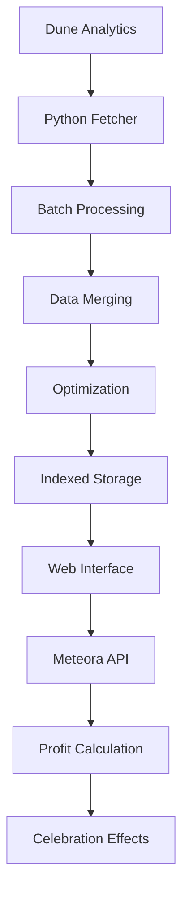

# 🚀 Meteora Profit Checker

[](https://github.com/gududefengzhong/meteora-profit-analysis)
[](https://dune.com/rochestor)
[](https://x.com/rochestor_mu)

A comprehensive tool for analyzing Meteora DLMM profits on Solana blockchain. Features batch data processing, multilingual interface, and celebration effects for profitable wallets.

## 🌟 Key Features

### 🔄 **Advanced Data Processing**
- **Batch Processing**: Handle multiple Dune query IDs simultaneously
- **Data Accumulation**: Merge historical data without overwriting
- **Smart Indexing**: Optimized storage for GitHub deployment
- **Auto-Deduplication**: Prevent duplicate trading pairs

### 🌍 **Multilingual Support**
- **7 Languages**: English, Chinese, Japanese, Malay, Korean, French, German
- **Real-time Switching**: Change language without page reload
- **Localized Messages**: All UI elements fully translated

### 🎉 **Interactive Experience**
- **Celebration Effects**: Confetti and fireworks for profitable wallets
- **Progress Tracking**: Real-time query progress display
- **Responsive Design**: Works on desktop and mobile devices

## 🚀 Quick Start

### Prerequisites
- Python 3.7+
- Dune Analytics account with API key
- Modern web browser

### Step 1: Install Dependencies
```bash
pip install dune-client pandas python-dotenv
```

### Step 2: Configure Environment
Create `.env` file in project root:
```bash
DUNE_API_KEY=your_dune_api_key_here
```

**Get Dune API Key:**
1. Visit [Dune Settings](https://dune.com/settings/api)
2. Create new API key
3. Copy to `.env` file

### Step 3: Run Data Fetcher
```bash
python meteora_data_fetcher.py
```

**What happens:**
- Fetches data from Dune Analytics
- Processes and optimizes storage
- Creates indexed wallet data
- Generates web-ready files

### Step 4: Launch Web Interface
```bash
# Start local server
python -m http.server 8000

# Open browser
open http://localhost:8000/fees_checker.html
```

## 📁 Project Structure

```
meteora-profit-analysis/
├── meteora_data_fetcher.py    # Main data fetcher
├── fees_checker.html          # Multilingual web interface
├── .env                       # API configuration
├── meteora_data/             # Generated data directory
│   ├── wallet_index.json    # Wallet lookup index
│   ├── wallets_*.json       # Grouped wallet data
│   ├── metadata.json        # Data statistics
│   └── merged_dune_data.csv # Raw merged data
└── README.md                # This file
```

## 🔧 Advanced Configuration

### Batch Processing Options
```python
# In meteora_data_fetcher.py or via environment variables
query_ids = [5556654, 5556655, 5556656]  # Multiple months/queries
fetcher = MeteoraDataFetcher(query_ids)

# Run with advanced options
fetcher.run_data_fetch(
    preserve_batches=True,    # Don't overwrite historical batches
    accumulate_data=True,     # Merge with existing data
    batch_delay=2.0          # Delay between API calls
)
```

### Environment Variables
```bash
# .env file
DUNE_API_KEY=your_api_key_here
DUNE_QUERY_IDS=5556654,5556655,5556656  # Optional: multiple queries
BATCH_DELAY=2.0                         # Optional: custom delay
```

## 🌍 Language Support

The web interface supports 7 languages with complete translations:

| Language | Code | Flag | Status |
|----------|------|------|--------|
| English | `en` | 🇺🇸 | ✅ Complete |
| Chinese | `zh` | 🇨🇳 | ✅ Complete |
| Japanese | `ja` | 🇯🇵 | ✅ Complete |
| Malay | `ms` | 🇲🇾 | ✅ Complete |
| Korean | `ko` | 🇰🇷 | ✅ Complete |
| French | `fr` | 🇫🇷 | ✅ Complete |
| German | `de` | 🇩🇪 | ✅ Complete |

## 🎯 Use Cases

### Scenario 1: Monthly Data Collection
```bash
# January data
DUNE_QUERY_IDS=5556654 python meteora_data_fetcher.py

# February data (accumulates with January)
DUNE_QUERY_IDS=5556655 python meteora_data_fetcher.py

# March data (accumulates with previous months)
DUNE_QUERY_IDS=5556656 python meteora_data_fetcher.py
```

### Scenario 2: Bulk Historical Analysis
```bash
# Process all months at once
DUNE_QUERY_IDS=5556654,5556655,5556656 python meteora_data_fetcher.py
```

### Scenario 3: Regular Updates
```bash
# Set up cron job for daily updates
0 2 * * * cd /path/to/project && python meteora_data_fetcher.py
```

## 📊 Data Flow



## 🛠️ Technical Details

### Data Storage Strategy
- **Grouped Storage**: Wallets grouped by address prefix
- **Indexed Lookup**: Fast wallet-to-file mapping
- **Compressed JSON**: Minimal file sizes for GitHub
- **GitHub Optimized**: Maximum 16 files, balanced sizes

### API Integration
- **Dune Analytics**: Batch data fetching with rate limiting
- **Meteora API**: Real-time profit calculations
- **Error Handling**: Comprehensive retry mechanisms
- **Progress Tracking**: Real-time status updates

### Performance Features
- **Lazy Loading**: Only load required data files
- **Concurrent Requests**: Parallel API calls with limits
- **Caching**: Browser-side data caching
- **Responsive UI**: Smooth user experience

## 🐛 Troubleshooting

### Common Issues

**"Wallet not found"**
- Ensure wallet address is valid Solana format
- Check if data fetcher has been run
- Verify wallet has Meteora DLMM activity

**"Network error"**
- Check internet connection
- Verify Meteora API status
- Try increasing request delays

**"Data loading failed"**
- Ensure local server is running
- Check file permissions
- Verify JSON file integrity

### Debug Mode
```bash
# Enable verbose logging
DEBUG=1 python meteora_data_fetcher.py
```

## 🤝 Contributing

We welcome contributions! Please see our contributing guidelines:

1. Fork the repository
2. Create a feature branch
3. Make your changes
4. Add tests if applicable
5. Submit a pull request

### Development Setup
```bash
git clone https://github.com/gududefengzhong/meteora-profit-analysis.git
cd meteora-profit-analysis
pip install -r requirements.txt
cp .env.example .env  # Configure your API key
```

## 📄 License

This project is open source and available under the [MIT License](LICENSE).

## 🙏 Acknowledgments

Special thanks to:
- **[Meteora](https://meteora.ag/)**: For providing excellent DeFi infrastructure and APIs
- **[Dune Analytics](https://dune.com/)**: For powerful blockchain data query platform
- **Solana Community**: For building an amazing ecosystem

## 📞 Contact & Support

### Developer Contact
- **Twitter**: [@rochestor_mu](https://x.com/rochestor_mu)
- **GitHub**: [gududefengzhong](https://github.com/gududefengzhong)
- **Dune**: [rochestor](https://dune.com/rochestor)

### Support
- 📖 Check this README for common solutions
- 🐛 [Report bugs](https://github.com/gududefengzhong/meteora-profit-analysis/issues)
- 💡 [Request features](https://github.com/gududefengzhong/meteora-profit-analysis/issues)
- 💬 Join community discussions

## ⚠️ Disclaimer

**Important Notice:**
- This tool is for reference only and may contain delays or errors
- Always verify final profit data with official Meteora platform
- Developer is not responsible for any losses from using this tool
- This is an open-source community project, not affiliated with Meteora

---

**Made with ❤️ for the Solana and Meteora community**

🎉 **Happy profit checking!** 🚀
